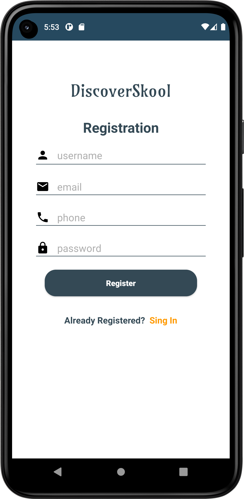

# DiscoverSkul
# Status :white_X_mark:  DONE :white_check_mark:.
### What is GADS
Google Africa Developer Scholarship program is a Grow with Google, Andela, and Pluralsight partnership to support software developers in Africa on Android, Google Cloud, and Mobile Web courses. The aim of this program is to continuously engage with aspiring and existing developers on these tracks to become professional developers with skills that can get them opportunities after the program.
### What is ALC
The Andela Learning Community is a network of technologists and tech enthusiasts across Africa dedicated to learning how to use technology to solve humanity’s problems. The ALC facilitates your learning through the aid of guided mentorship from super awesome learning community ambassadors.
# DiscoverSkool Android Application
DiscoverSkool is an android application that  I'm developing for my project phase in the #2022GADS scholarship program. 
- Search through school profiles
- Send application to schools
- Create a user profile
# Sreenshots
    

## Tech Stack.
- [Java](https://developer.android.com/studio/write/java8-support?gclid=CjwKCAiA68ebBhB-EiwALVC-NrHBWyF1NkQ3cE87Mr94ZDB2BsAxAsRpCmDJqi6vEKDlOeLfjhr_aRoCTwgQAvD_BwE&gclsrc=aw.ds) - Java is a programming language that can run on JVM. Google announced Java as one of its officially supported programming languages in Android Studio;
- [LiveData](https://developer.android.com/topic/libraries/architecture/livedata) -  A lifecycle-aware data holder with the observer pattern
- [View Binding](https://developer.android.com/topic/libraries/data-binding/) - Allows you to bind UI components in your layouts to data sources in your app using a declarative format rather than programmatically.
- [GitHub Actions](https://github.com/features/actions) - GitHub Actions makes it easy to automate all your software workflows, now with world-class CI/CD. Build, test, and deploy your code right from GitHub. Make code reviews, branch management, and issue triaging work the way you want.
- [Glide](https://github.com/bumptech/glide)- An image loading and caching library for Android focused on smooth scrolling.
- [SavedStateHandle](https://developer.android.com/guide/navigation/navigation-programmatic) - Getting results from a destination when navigating from one fragment to another
- [SafeApiCall](https://github.com/JoelKanyi/Savings-Zetu-App/blob/main/app/src/main/java/com/kanyideveloper/savingszetu/utils/ExtensionFunctions.kt) Making safe Firebase network calls
- [Firebase Functions](https://firebase.google.com/docs/functions) - Cloud Functions for Firebase is a serverless framework that lets you automatically run backend code in response to events triggered by Firebase features and HTTPS requests.
- [Firebase Database](https://firebase.google.com/docs/database) - Store and sync data with our NoSQL cloud database. Data is synced across all clients in realtime, and remains available when your app goes offline.
- [Firebase Authentication](https://firebase.google.com/docs/auth) - Firebase Authentication provides backend services, easy-to-use SDKs, and ready-made UI libraries to authenticate users to your app.
- [Firebase Messaging](https://firebase.google.com/docs/cloud-messaging) - Firebase Cloud Messaging (FCM) is a cross-platform messaging solution that lets you reliably send messages at no cost.
- [Firebase Storage](https://firebase.google.com/docs/storage) - Cloud Storage for Firebase is a powerful, simple, and cost-effective object storage service built for Google scale.
## Setup Requirements
- Android device or emulator
- Android Studio
- Create your own Firebase project and replace the `google-services.json` with yours.
## Getting Started
In order to get the app running yourself, you need to:

1.  Clone this project
2.  Import the project into Android Studio
3.  Connect your android device with USB or use your emulator
4.  After the project has finished resolving dependencies and building you run

## Development
For contributions.!
To fix a bug or enhance an existing module, follow these steps:

- Fork the repo
- Create a new branch (`git checkout -b improve-feature`)
- Make the appropriate changes in the files
- Add changes to reflect the changes made
- Commit your changes (`git commit -am 'Improve feature'`)
- Push to the branch (`git push origin improve-feature`)
- Create a Pull Request

## Support
- Found this project useful ❤️? Support by clicking the ⭐️ button on the upper right of this page. ✌️
- Notice anything else missing? File an issue 
- Feel free to contribute in any way to the project from typos in docs to code review are all welcome.

